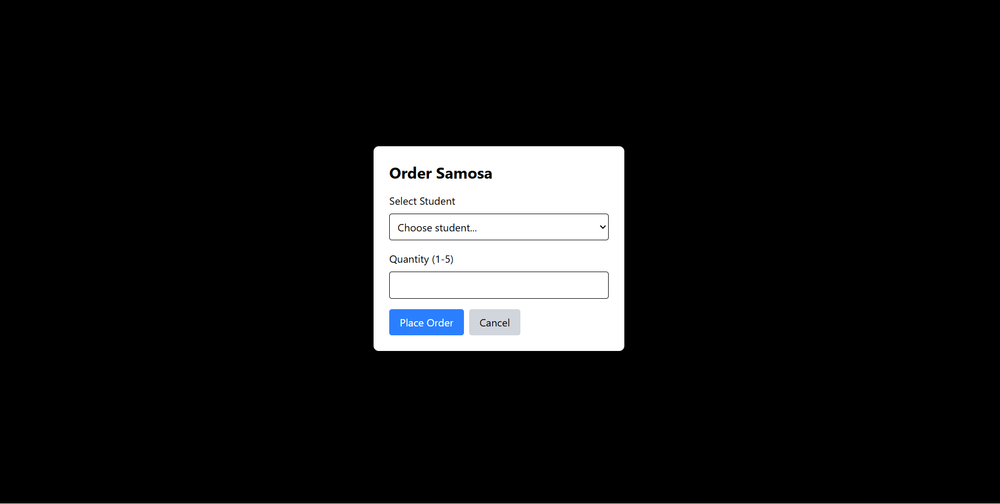
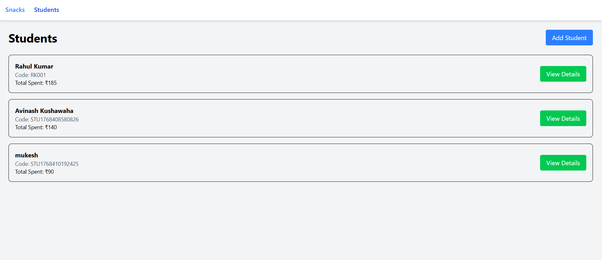
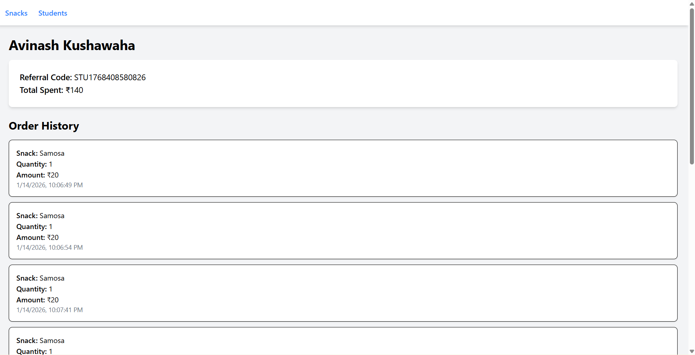
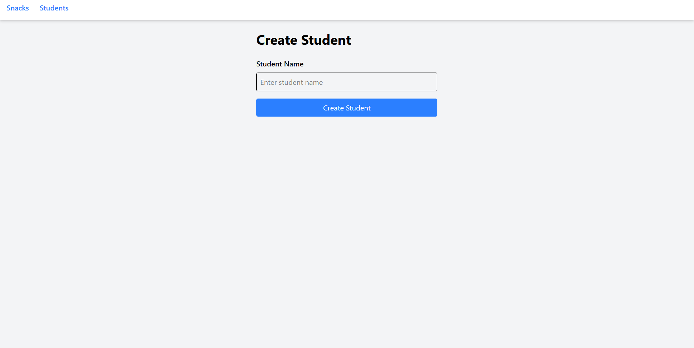

# 🍽️ School Canteen Management System

A modern, responsive web application for managing a school canteen's digital ordering system.  
Students can browse snacks, place orders, and track their spending and order history in real-time.

---

## ✨ Features

## 📸 Screenshots

### 🛒 Snacks Page

### 🧾 Order Modal

### 👨‍🎓 Students Page

### 📊 Student Detail Page (Order History)

### ➕ Create Student Page

### Core Functionality

- 🛒 **Browse Snacks** – View all available snacks with prices and popularity  
- 👨‍🎓 **Student Management** – Create and manage student profiles  
- 📦 **Order Placement** – Place orders with quantity selection (1–5 items)  
- 💰 **Spending Tracking** – Automatic calculation of total spending per student  
- 📊 **Order History** – Complete order history for each student  
- 🔄 **Real-time Updates** – Live updates of order counts and spending  

### Technical Features

- ⚡ Fast and responsive UI  
- 🎨 Modern design using Tailwind CSS  
- 📱 Fully responsive (Mobile, Tablet, Desktop)  
- ✅ Form validation using React Hook Form  
- 🔌 RESTful API integration with JSON Server  
- 🎯 Component-based architecture  
- 🗂️ Global state management using Zustand  
- 🚦 Loading states and error handling  
- 🎭 Modal-based interactions  

---

## 🛠️ Tech Stack

### Frontend

- React 18  
- React Router DOM  
- Zustand  
- React Hook Form  
- Axios  
- Tailwind CSS  

### Backend

- JSON Server (Mock REST API)

### Development Tools

- npm  
- ES6+ JavaScript  

>>>>>>> 223834b8a92c9ced82d0823cb6a5845d5ead302a
